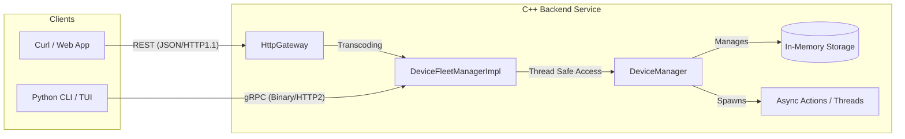
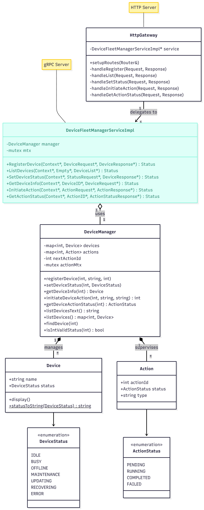
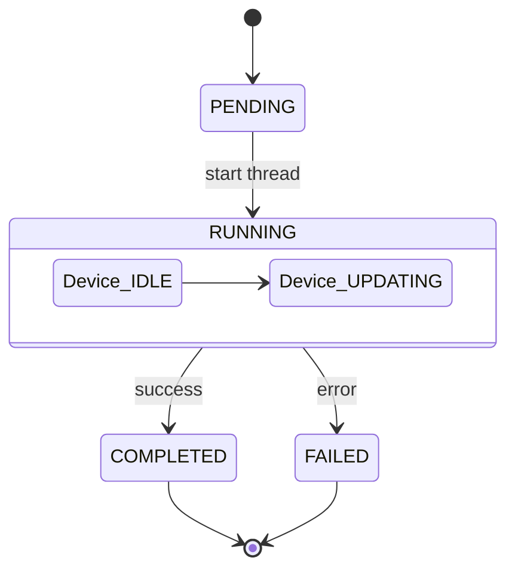
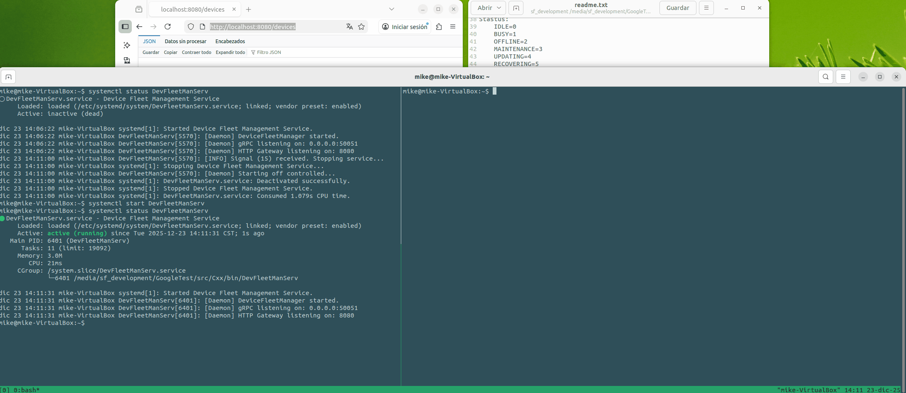
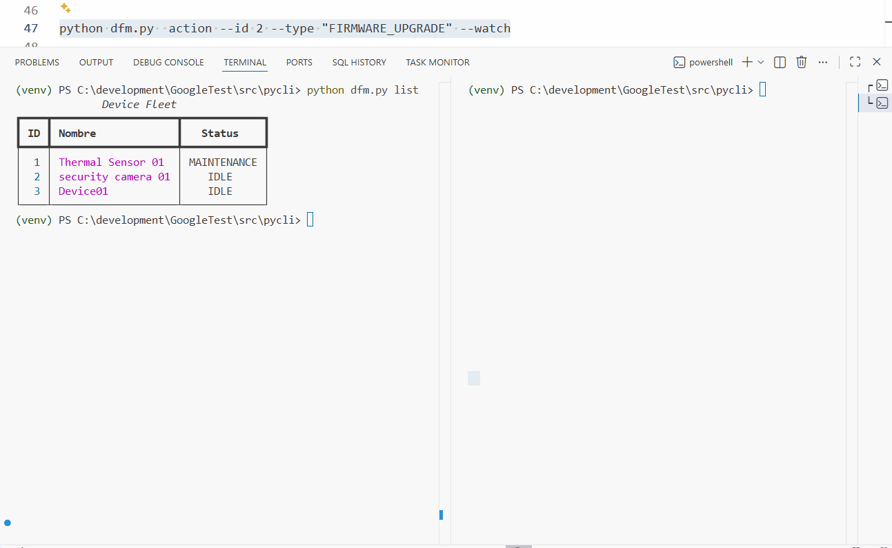

# Project Device Fleet Manager Daemon
### By Miguel Cetz González
(2025/12/22)


Hybrid system (gRPC + REST) ​​for the management of industrial devices, with support for asynchronous operations and state machines.

This project was devised as an exercise project to show the use of gRPC, along with HTTP. The device information is not stored persistently, it is only managed in memory. While the service is running, the data is maintained. When the service is stopped, the data disappears. However, it helps to understand complex topics such as multithreading and the creation of gRPC and HTTP servers (working together) and a very interesting configuration of the make file to be able to compile. I tried to make the design as modular as possible to make it as "easy" to uderstand and modify as possible. The project was an interesting challenge and could most likely be improved, but I only had three days to develop it. Still, I think it was quite easy to understand. I would like to improve the configuration and compilation in the future to make it more automated.


## 🚀 Architecture
The system acts as a **Dual Gateway**:
1.  **Clients:** Clients can connect via HTTP REST (curl/Web application) or gRPC. The gRPC client I built for testing is in Python (`dfm.py`) and the http client I used for testing was`curl`.
1.  **C++ Back-end Service:** Centralizes logic in`DeviceManager`. Exposes a gRPC server (port 50051) with`DeviceFleetManagerImpl`using the libraries`grpc`, `protobuf`), and also an HTTP REST server (port 8080) using the library`Pistache`.
2.  **Transcoding:** HTTP requests are dynamically converted to Protobuf messages to be processed by the same business logic as gRPC.
3.  **Concurrency:** Uses`std::mutex`and`std::lock_guard`to allow multiple clients (Python or Curl) to interact without memory conflicts.

- This diagram shows how both clients converge to the same C++ service.



- Class Diagram:


 
- Diagram showing the execution states of an Action (`DeviceManager::initiateDeviceAction`), when asked to perform a mock process:




## 🛠 Configuration and Construction (Linux)

### 📋 Prerequisites
- Ubuntu Linux 22.04.5
- C++17 Compiler (GCC/Clang)
- CMake 3.10+
- C++ Libraries:`grpc`, `protobuf`, `pistache`.
- Python 3.x with`grpcio grpcio-tools rich`.

### 📋 Backend construction
I tried to automate the system configuration as much as possible to be able to compile with the gRPC and pistache libraries. Below is a list of steps to tune up the system before compiling:

**1.** Install the gRPC libraries (I took the opportunity to install the pistache and json libraries for HTTP REST):
Execute the following script that is inside the **../src/proto** directory. That script should leave the libraries needed ready, the gRPC build took almost an hour.
 ```bash
./install_grpc.sh
```
**2.** Then go to the **../src/proto/** directory and edit `Make` file so it points to the right proto compiler path for `protoc` and `grpc_cpp_plugin`. Modify below variables:
 ```bash
cd ../src/proto/
nano Make

...

# Variables for routes
PROTOC = `directory where libray was installed goes here../bin/protoc`
GRPC_PLUGIN = `directory where libray was installed goes here../bin/grpc_cpp_plugin`

```

**3.** Now run make inside **../src/proto/** directory to generate the gRPC files
 ```bash
make
```

This should generate the following files:
- DeviceFleetManager.pb.cc
- DeviceFleetManager.pb.h
- DeviceFleetManager.grpc.pb.cc
- DeviceFleetManager.grpc.pb.h


**3.** With this, everything necessary to compile the project and generate the executable should be ready. Change to the directory **../src/Cxx/** and run the following script which runs the`cmake`and then the`make`to build the final file, which is left in **../src/Cxx/bin**.
 ```bash
./buildapp.sh

```

**4.** After generating the executable. Change to the directory **../src/systemd/** and modify the file`DevFleetManServ.service`the section`ExecStart=`so that it points to the executable we just generated.
 ```bash
[Unit]
Description=Device Fleet Management Service
After=network.target

[Service]
Type=simple
ExecStart=/...your directory here.../DevFleetManServ
Restart=always

StandardOutput=journal
StandardError=journal

[Install]
WantedBy=multi-user.target

```

**5.** After changing the section`ExecStart=`so that it points to the executable we just generated. Copy the file to the **/etc/systemd/system** directory. Start the service and try the following commands:
 ```bash
#Start the service:
 sudo systemctl start DevFleetManServ

#Check if it is running:
 sudo systemctl status DevFleetManServ

#View the logs (the console output):
journalctl -u DevFleetManServ -f

#Stop it:
 sudo systemctl stop DevFleetManServ

```

**6.** Before running the python client or trying curl, start the service:
 ```bash
#Start the service:
 sudo systemctl start DevFleetManServ
```

**7.** Test that it works using`curl`:
 ```bash
#Stastus:
#    IDLE=0
#    BUSY=1
#    OFFLINE=2
#    MAINTENANCE=3
#    UPDATING=4
#    RECOVERING=5
#    ERROR=6


#List all devices:
curl -G http://localhost:8080/devices

# Register devices:
curl -X POST http://localhost:8080/device/register \
     -H "Content-Type: application/json; charset=UTF-8" \
     -d '{"id": 1, "name": "Thermal Sensor 01", "status": 0}'

curl -X POST http://localhost:8080/device/register \
     -H "Content-Type: application/json; charset=UTF-8" \
     -d '{"id": 2, "name": "Security camera 01", "status": 0}'

curl -X POST http://localhost:8080/device/register \
     -H "Content-Type: application/json; charset=UTF-8" \
     -d '{"id": 3, "name": "Device 01", "status": 0}'


# To update the device status:
curl -X POST http://localhost:8080/device/status \
     -H "Content-Type: application/json" \
     -d '{"id": 1, "status": 3}'


# Launch action to execute:
curl -X POST http://localhost:8080/device/action \
     -H "Content-Type: application/json" \
     -d '{"device_id": 1, "action_type": "SOFTWARE_UPDATE", "params": "v2.0.4"}'

curl -X POST http://localhost:8080/device/action -d '{"device_id": 1, "action_type": "UPDATE"}'     

#status of the action launched:
curl -X GET http://localhost:8080/action/:id/status | jq
curl http://localhost:8080/action/5/status


#Action states:
#0 (PENDING): The action was created but the thread has not yet started the heavy work.
#1 (RUNNING): The thread is executing the 15 second sleep_for.
#2 (COMPLETED): The thread ended and the device state returned to IDLE.
#3 (FAILED): There was an error or the ID does not exist and the device status returned to IDLE.

```

If everything works correctly, we move on to configuring the python client.


### 📋 Python Client Configuration
First activate the python environment before installing the dependencies and running the command that generates the gRPC files for python.
In Windows (in Windows I was running my client to test that it worked), Go to the directory **.../src/pycli**, the activation of the environment is as follows:
 
**1.** Activate the python environment:
```bash
python -m venv venv
.venv\Scripts\activate
```
**2.** Install dependencies:
```bash
pip install -r requirements.txt
```

**3.** Create the gRPC files for python:
`"With the environment activated in python"`: go to the directory **../src/proto** and execute the following command:
```bash
python -m grpc_tools.protoc -I. --python_out=. --grpc_python_out=. DeviceFleetManager.proto
```
This should generate the following files in the ../src/proto directory:
- DeviceFleetManager_pb2_grpc.py
- DeviceFleetManager_pb2.py

**4.** Copy the .py files generated inside the **../src/proto** directory to the **../src/pycli/** directory so that python can find them:
```bash
cp *.py ..\pycli\
```
You must return to the **../src/pycli/** directory. After all this configuration, the python client will be able to run without problems.

**5.** To test with the python client you can use the following commands
```bash
#Register a new device
python dfm.py register --id 50 --name "Room thermostat" --status 0
python dfm.py register --id 10 --name "Scout Drone" --status 0
python dfm.py register --id 11 --name "Base Station" --status 0

#List existing devices
python dfm.py list

#Launch a simulation of a running process.
python dfm.py  action --id 50 --type "FIRMWARE_UPGRADE" --watch


```


#### Definition of the gRPC service (.proto)
```javascript
syntax = "proto3";

package devicefleetmanager;

service DeviceFleetManagerService {
  rpc RegisterDevice (DeviceRequest) returns (DeviceResponse);
  rpc ListDevices (Empty) returns (DeviceList);
  rpc SetDeviceStatus (StatusRequest) returns (DeviceResponse);
  rpc GetDeviceInfo (DeviceID) returns (DeviceRequest);
  rpc InitiateAction (ActionRequest) returns (ActionResponse);
  rpc GetActionStatus (ActionID) returns (ActionStatusResponse);
}

message Empty {}

message DeviceID {
  int32 id = 1;
}

message DeviceRequest {
  int32 id = 1;
  string name = 2;
  int32 status = 3; //Mapped to C++ enum
}

message DeviceResponse {
  bool success = 1;
  string message = 2;
}

message DeviceList {
  repeated DeviceRequest devices = 1;
}

message StatusRequest {
  int32 id = 1;
  int32 status = 2;
}

message ActionRequest {
  int32 device_id = 1;
  string action_type = 2;
  string params = 3;
}

message ActionResponse {
  int32 action_id = 1;
}

message ActionID {
  int32 id = 1;
}

message ActionStatusResponse {
  int32 status = 1; // 0:PENDING, 1:RUNNING, 2:COMPLETED, 3:FAILED
}
```
### 🖼 Screenshots
- Server running
- HTTP Client using curl

- Python Client running (dfm.py)



### 📝 Assumptions and Improvements
If there was more time:
- Change the cmake so that it compiles dynamically and not statically.
- Improve CMakeLists.txt so that it compiles .proto files.
- Improve the scripts to configure the project and not have to do several steps.
- Data persistence is volatile (in memory). If the daemon stops, data is lost.
- Asynchronous actions are simulated with sleep_for. There are no automatic retries if an action fails.
- Implement persistence in SQLite or Redis.
- Add JWT authentication for the HTTP Gateway.
- Implement a structured log system.


